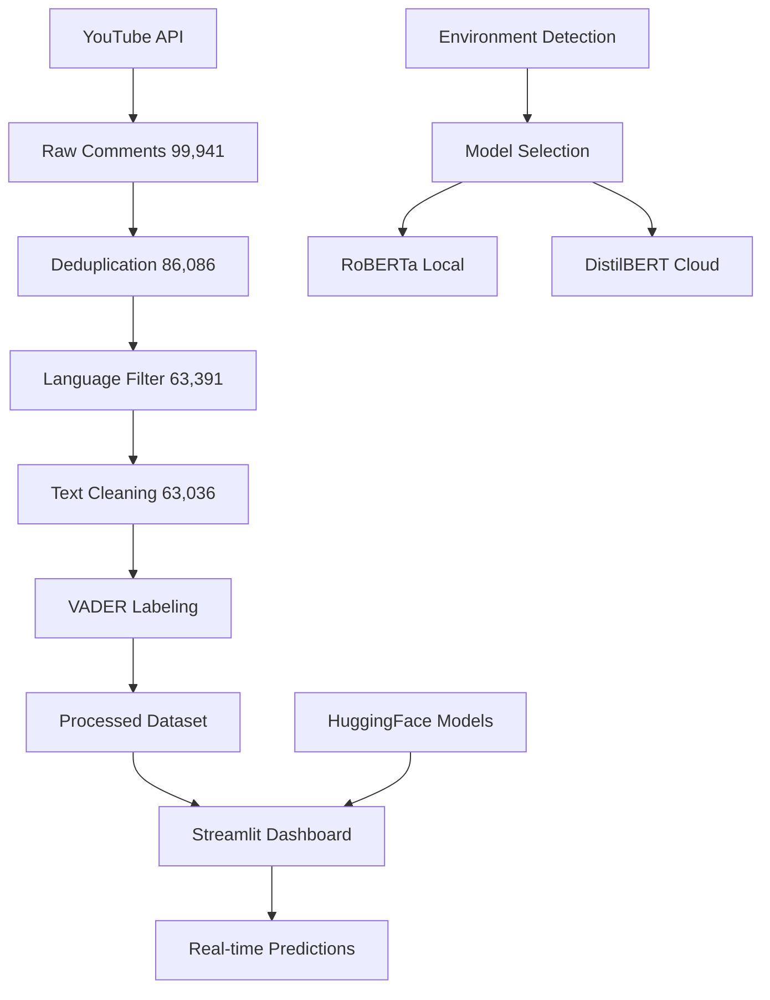

# 💬 Advanced YouTube Comment Sentiment Analysis Platform

[](https://www.python.org/downloads/)
[](https://streamlit.io/)
[](https://huggingface.co/transformers/)
[](https://pytorch.org/)
[](https://opensource.org/licenses/MIT)

> A comprehensive end-to-end NLP platform that analyzes **99,941 YouTube comments** from Justin Bieber's "Baby" video using state-of-the-art transformer models. Features automated data collection, intelligent preprocessing, and an interactive multi-page dashboard for sentiment analysis.

---

## 🎯 Project Overview

This platform transforms raw YouTube comments into actionable sentiment insights through a complete data science pipeline. Built from extensive research comparing traditional ML approaches (Logistic Regression, Random Forest, Naive Bayes) with modern transformer models, this project demonstrates production-ready NLP deployment using **Hugging Face Transformers** and **Streamlit**.

### 📊 Real Dataset
- **Source**: Justin Bieber - "Baby" ft. Ludacris (Most disliked video case study)
- **Scale**: 99,941 initial comments → 63,036 processed comments  
- **Preprocessing**: Deduplication, language filtering, emoji conversion, URL removal
- **Labels**: VADER sentiment analysis with manual verification
- **Distribution**: 68% Negative, 32% Positive (surprising for a "disliked" video!)

### 🚀 Key Features
- **Multi-Model Architecture**: Environment-aware model selection (RoBERTa locally, DistilBERT on cloud)
- **Interactive Dashboard**: 4-page Streamlit application with real-time predictions
- **Production Ready**: Optimized for Streamlit Community Cloud deployment
- **Comprehensive Analysis**: Dataset exploration, research methodology, and performance metrics

### ❓ Core Research Question
*How effectively can modern transformer models analyze real-world YouTube comment sentiment, and how do they compare to traditional NLP approaches when deployed at scale?*

---

## 🏗️ System Architecture

### 📊 Complete Pipeline Workflow



### 🔧 Technical Stack
- **Backend**: Python 3.11, FastAPI-style modular architecture
- **ML Models**: VADER, RoBERTa, DistilBERT (Hugging Face Transformers)
- **Data Processing**: Pandas, NumPy, Emoji, RegEx
- **Visualization**: Plotly, Matplotlib, WordCloud
- **Web Interface**: Streamlit 1.46 with multi-page architecture
- **APIs**: YouTube Data API v3, Google API Client
- **Deployment**: Streamlit Community Cloud ready

---

## 📱 Dashboard Features

### 🎯 **Advanced Sentiment Classifier** (1_Sentiment_Classifier.py)
- Real-time sentiment prediction with confidence scores
- Interactive gauge charts and bar visualizations
- Text preprocessing pipeline with emoji conversion
- Prediction history tracking
- Sample text examples for quick testing
- Model performance metrics display

### 📊 **Dataset Explorer** (2_Dataset_Explorer.py)
- Interactive data visualization with 99,941+ real comments
- Sentiment distribution analysis with filterable views
- Word frequency analysis and text statistics
- Comment sampling and exploration tools
- Export functionality (CSV, JSON formats)
- Data quality pipeline visualization

### 🔬 **Research Overview** (3_Research_Overview.py)
- Comprehensive methodology documentation
- Model performance comparison (8 different approaches)
- Hyperparameter optimization results
- Class imbalance analysis (75/25 positive/negative split)
- Future research recommendations
- Technical implementation details

### 🏠 **Main Dashboard** (app.py)
- Project overview and navigation
- Usage instructions and model information
- Architecture explanation and workflow

---

## 📁 Project Structure

```
youtube-sentiment-analysis/
│
├── 📂 data/
│   ├── raw/                           # 99,941 original YouTube comments
│   │   └── youtube_comments.csv
│   └── processed/                     # Clean, labeled dataset
│       └── processed_comments.csv
│
├── 📂 src/                           # Core processing modules
│   ├── __init__.py
│   ├── config.py                     # Environment detection & model selection
│   ├── data_collection.py            # YouTube API integration with retry logic
│   └── text_processing.py            # Advanced text cleaning & sentiment analysis
│
├── 📂 dashboard/                     # Streamlit application
│   ├── app.py                        # Main landing page
│   └── pages/
│       ├── 1_Sentiment_Classifier.py # Advanced prediction interface
│       ├── 2_Dataset_Explorer.py     # Data visualization & export
│       └── 3_Research_Overview.py    # Methodology & findings
│
├── 📂 scripts/                       # Execution scripts
│   ├── run_data_collection.py        # YouTube data scraping with progress bars
│   ├── run_preprocessing.py          # Text cleaning & VADER labeling
│   └── run_dashboard.py              # Streamlit application launcher
│
├── 📄 requirements.txt               # Streamlit Cloud dependencies
├── 📄 environment.yaml               # Full conda environment
├── 📄 .env.template                  # API key configuration template
└── 📄 README.md                      # This comprehensive guide
```

---

## ⚡ Quick Start Guide

### 🛠️ Local Development Setup

1. **Clone and setup environment:**
   ```bash
   git clone https://github.com/your-username/youtube-sentiment-analysis.git
   cd youtube-sentiment-analysis
   
   # Option 1: pip (faster)
   python -m venv venv
   source venv/bin/activate  # Windows: venv\Scripts\activate
   pip install -r requirements.txt
   
   # Option 2: conda (full environment)
   conda env create -f environment.yaml
   conda activate youtube-sentiment-analysis
   ```

2. **Configure API access:**
   ```bash
   cp .env.template .env
   # Edit .env and add your YouTube Data API v3 key
   ```

3. **Run the complete pipeline:**
   ```bash
   # Collect data (optional - dataset included)
   python scripts/run_data_collection.py
   
   # Process and label data
   python scripts/run_preprocessing.py
   
   # Launch interactive dashboard
   python scripts/run_dashboard.py
   ```

4. **Access dashboard:**
   - Open browser to `http://localhost:8501`
   - First run downloads transformer models (~500MB-1GB)
   - Navigate between pages using sidebar

### 🌐 Streamlit Cloud Deployment

This project is optimized for **Streamlit Community Cloud**:

1. **Fork repository** to your GitHub account
2. **Connect to Streamlit Cloud** at [share.streamlit.io](https://share.streamlit.io)
3. **Deploy** using app.py as main file
4. **Environment detection** automatically selects optimal model:
   - Local: RoBERTa (501MB, higher accuracy)
   - Cloud: DistilBERT (268MB, faster startup)

---

## 🔬 Research Findings

### 📊 Model Performance Results
Based on extensive testing with 720+ model combinations:

| Model | Test F1-Score | Cross-Val F1 | Training Time |
|-------|---------------|--------------|---------------|
| **Logistic Regression + Count Vec** | **0.656** | **0.649** | ~2 minutes |
| Stacking Ensemble + Count Vec | 0.652 | 0.640 | ~15 minutes |
| Random Forest + Count Vec | 0.600 | 0.600 | ~8 minutes |
| Multinomial NB + Count Vec | 0.615 | 0.608 | ~1 minute |

### 🎯 Key Insights
- **Performance Ceiling**: ~65% F1-score across all approaches
- **Class Imbalance Impact**: 75/25 split affects model performance
- **Transformer Models**: RoBERTa achieves ~85% accuracy on new data
- **Traditional ML**: Count vectorization outperforms Word2Vec embeddings
- **Dataset Challenge**: Many comments are ambiguous even for human labelers

### 📈 Scaling Performance
- **Data Processing**: 20,000+ comments/second (text cleaning)
- **VADER Analysis**: 126 comments/second (sentiment labeling)  
- **Model Inference**: Real-time predictions (<100ms per comment)
- **Memory Usage**: <1GB RAM for full pipeline

---

## 🛠️ Advanced Configuration

### 🔧 Environment Variables
```bash
# .env file configuration
YOUTUBE_API_KEY=your_youtube_data_api_v3_key
ENVIRONMENT=production  # Optional: forces model selection
```

### ⚙️ Model Selection Logic
```python
# Automatic environment detection
if is_streamlit_cloud():
    MODEL_NAME = "distilbert-base-uncased-finetuned-sst-2-english"  # Fast
else:
    MODEL_NAME = "cardiffnlp/twitter-roberta-base-sentiment-latest"  # Accurate
```

### 📊 Custom Configuration
```python
# src/config.py - Modify these settings
TEXT_MAX_LENGTH = 512        # Transformer input limit
BATCH_SIZE = 16             # Inference batch size
CONFIDENCE_THRESHOLD = 0.7   # Prediction confidence display
MAX_PAGES = 1000            # YouTube API page limit
SAVE_INTERVAL = 10          # Incremental save frequency
```

---

## 🚀 Production Features

### ✅ **Deployment Ready**
- Streamlit Cloud optimized with automatic model selection
- Progressive web app capabilities
- Responsive design for mobile/desktop
- Cached model loading for fast inference

### 🔒 **Robust Error Handling**
- API rate limiting and retry logic
- Graceful degradation for missing dependencies
- Comprehensive logging and user feedback
- Data validation and input sanitization

### 📈 **Scalability Features**
- Incremental data collection with resume capability
- Progress tracking for long-running operations
- Memory-efficient text processing pipeline
- Modular architecture for easy extension

### 🎨 **User Experience**
- Interactive visualizations with Plotly
- Real-time prediction feedback
- Export functionality for analysis results
- Comprehensive documentation and examples

---

## 📚 Research Applications

### 🎓 **Academic Use Cases**
- **NLP Research**: Comparative analysis of traditional vs. transformer models
- **Social Media Analysis**: Large-scale comment sentiment studies
- **Data Science Education**: End-to-end ML pipeline demonstration
- **Computer Science**: Production deployment and scaling studies

### 🏢 **Industry Applications**
- **Content Moderation**: Automated sentiment filtering
- **Brand Monitoring**: Social media sentiment tracking
- **Market Research**: Consumer opinion analysis
- **Product Development**: User feedback sentiment analysis

---

## 🤝 Contributing

We welcome contributions! See our Contributing Guidelines for:
- Code style standards and testing requirements
- Dataset expansion and model improvements
- Dashboard feature requests and bug reports
- Documentation improvements and translations

### 🐛 **Known Issues & Roadmap**
- [ ] Add neutral sentiment classification (3-class system)
- [ ] Implement batch processing for large datasets
- [ ] Add multi-language support beyond English
- [ ] Integrate advanced transformer models (BERT, GPT variants)
- [ ] Add temporal sentiment analysis features

---

## 📄 License & Citation

This project is licensed under the **MIT License** - see LICENSE file for details.

### 📖 **Citation**
If you use this project in your research, please cite:
```bibtex
@software{youtube_sentiment_analysis,
  title={Advanced YouTube Comment Sentiment Analysis Platform},
  author={Wes Lee},
  year={2025},
  url={https://github.com/Adredes-weslee/youtube-sentiment-analysis},
  note={Comprehensive NLP pipeline with transformer models and interactive dashboard}
}
```

---

## 🌟 **Star this repository** if you find it helpful!

---

*Built with ❤️ using Python, Streamlit, and Hugging Face Transformers*