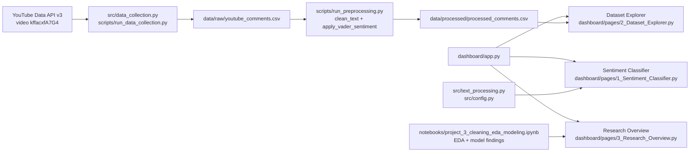

# Advanced YouTube Comment Sentiment Analysis Platform

A Streamlit-based YouTube comment sentiment app centered on Justin Bieber's `"Baby"` video, with committed raw and processed CSVs containing 114,109 comments.

The shipped UI is a three-page dashboard with a sentiment classifier, dataset explorer, and research overview.

<!-- README_SURFACE_START -->

```mermaid
flowchart LR
  YT["YouTube Data API v3<br/>video kffacxfA7G4"] --> COL["src/data_collection.py<br/>scripts/run_data_collection.py"]
  COL --> RAW["data/raw/youtube_comments.csv"]
  RAW --> PRE["scripts/run_preprocessing.py<br/>clean_text + apply_vader_sentiment"]
  PRE --> PROC["data/processed/processed_comments.csv"]

  APP["dashboard/app.py"] --> CLS["Sentiment Classifier<br/>dashboard/pages/1_Sentiment_Classifier.py"]
  APP --> EXP["Dataset Explorer<br/>dashboard/pages/2_Dataset_Explorer.py"]
  APP --> RES["Research Overview<br/>dashboard/pages/3_Research_Overview.py"]

  TXT["src/text_processing.py<br/>src/config.py"] --> CLS
  PROC --> EXP
  NB["notebooks/project_3_cleaning_eda_modeling.ipynb<br/>EDA + model findings"] --> RES
```

[](https://adredes-weslee.github.io/nlp/machine-learning/transformers/2024/12/15/building-youtube-comment-sentiment-analyzer.html) [](https://adredes-weslee-sentiment-analysis-and-nlp-f-dashboardapp-kqphrr.streamlit.app/)

  

## Quickstart

```bash
copy .env.template .env  # or cp .env.template .env
python scripts/run_preprocessing.py
python scripts/run_dashboard.py
```

See [Setup and Run](#setup-and-run) for the full environment and verification path.

<!-- README_SURFACE_END -->

## Why This Repository Exists

- Turn a large comment corpus into something a user can inspect, label, and compare for audience reaction analysis and sentiment review.
- The notebook narrative frames the use case as artist-management or reputation monitoring, with model selection optimized around negative-comment detection.

## Architecture at a Glance

- Collection layer: `src/data_collection.py` calls the YouTube Data API v3, fetches top-level comments plus replies for video `kffacxfA7G4`, and saves incrementally.
- Processing layer: `scripts/run_preprocessing.py` reads the raw CSV, auto-detects the comment column, cleans text, and writes `comment_raw`, `comment_cleaned`, and `sentiment` to `data/processed/processed_comments.csv`.
- UI layer: `scripts/run_dashboard.py` launches `dashboard/app.py`, while the classifier page uses a cached Hugging Face sentiment pipeline and the explorer reads local CSVs directly.
- Config layer: `src/config.py` loads `.env` and switches model names based on Streamlit Cloud detection.

## Repository Layout

- `dashboard/`
- `data/`
- `notebooks/`
- `scripts/`
- `src/`
- `.env.template`
- `.gitignore`
- `environment.yaml`
- `README.md`
- `requirements.txt`

## Setup and Run

1. Prefer `environment.yaml` if you want the full repo to work; `requirements.txt` is not complete for every import used by the scripts and dashboard pages.
2. Copy `.env.template` to `.env` and set `YOUTUBE_API_KEY` only if you plan to collect fresh data; the dashboard can run from the committed CSVs without.
3. Run `python scripts/run_preprocessing.py`, then `python scripts/run_dashboard.py`; run `python scripts/run_data_collection.py` only for new API pulls.

## Core Workflows

- Collection workflow: YouTube API -> top-level comments plus replies -> incremental saves every 10 pages; the script can reload an existing CSV, but it does not persist page tokens.
- Cleaning and labeling workflow: emoji demojize, URL/HTML removal, contraction expansion, whitespace normalization, then binary VADER labels.
- Exploration workflow: the dataset page loads `processed_comments.csv` when present, otherwise falls back to raw data with VADER or keyword sentiment, then charts distributions and exports.
- Classifier workflow: user text is cleaned, truncated to model length, passed through a cached transformer pipeline, and stored in session history.
- Research workflow: the overview page presents static comparisons of CountVectorizer, TF-IDF, and Word2Vec features paired with Logistic Regression, Naive Bayes, Random Forest, Gradient Boosting, and stacking models.

## Known Limitations

- The repo's published counts conflict. The CSVs contain 114,109 rows, but the notebook and dashboard text also mention 99,941 initial comments, 63,036 final comments, a 75/25 split, and different performance figures.
- `dashboard/app.py` says a Logistic Regression classifier was trained, but the runnable code ships no saved model or training script; the live classifier uses a pre-trained Hugging Face pipeline instead.
- No `LICENSE`, tests, or CI files are present, so MIT-license or automated-verification claims would be unsupported.
- The raw CSV is multilingual, while the notebook narrative mentions English-only filtering; the shipped preprocessing script does not perform language filtering or deduplication.
- The preprocessing pipeline is binary only. `apply_vader_sentiment` writes `positive`/`negative`, so neutral is not part of the saved dataset even though some UI fallback code can emit it.
- Some dashboard and docs metrics are hardcoded and should be treated as notebook-derived results, not live app output.
